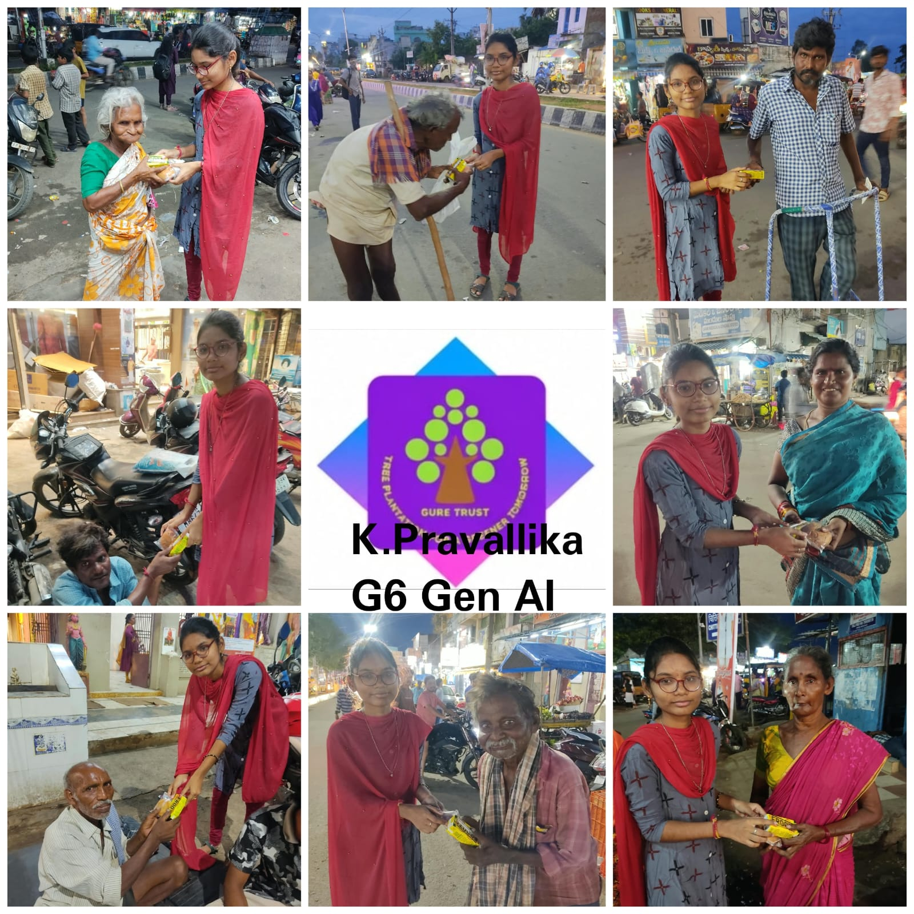
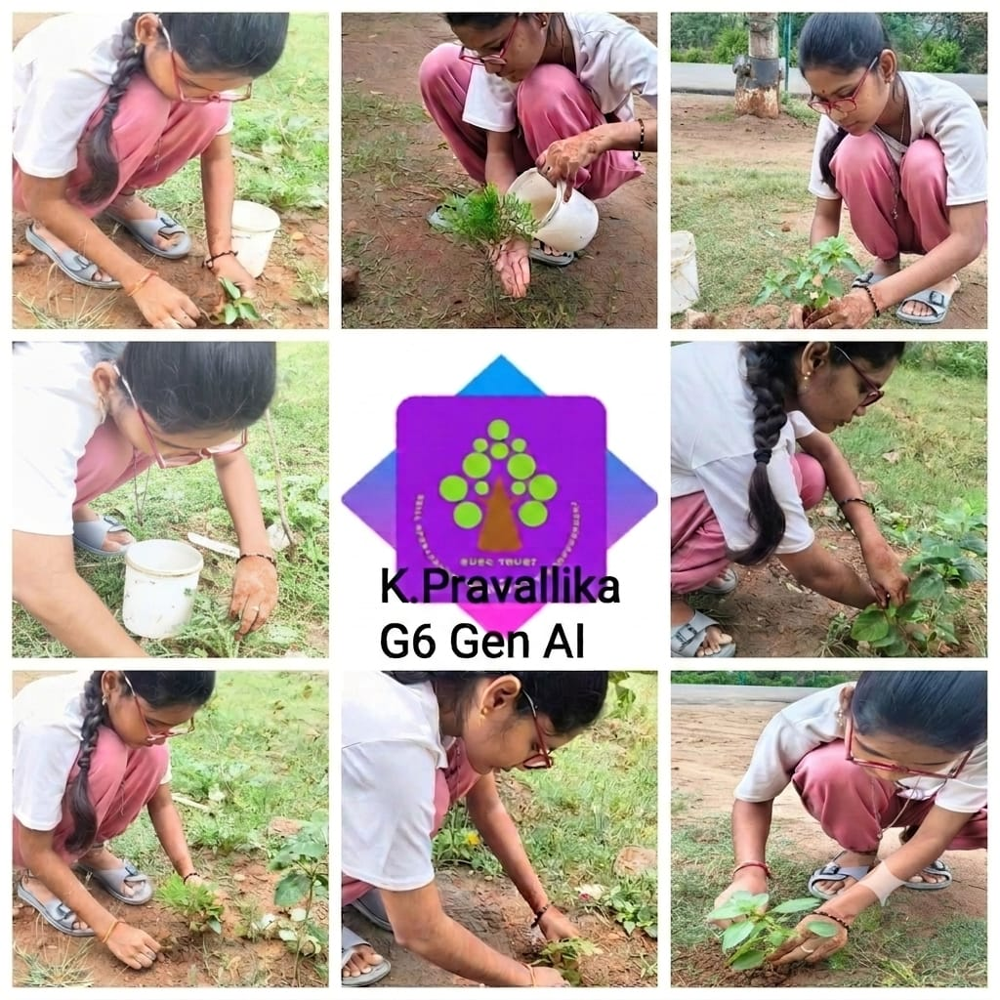

    

  <h1 align="center" style="font-family: Arial; font-weight: 600; margin-top: 15px;">SURE ProEd (formerly SURE Trust) 
      </h1>
<h2 style="color: #2b6cb0; font-family: Arial;">Skill Upgradation for Rural youth Empowerment Trust</h2>

<h2 style = "color:#333;"> Student Details </h2>

    
<strong>Name:</strong> Kummetha Pravallika 

    
<strong>Email ID:</strong> pravallikag6genai@gmail.com 

    
<strong>College Name:</strong> Raghu Engineering College 

    
<strong>Branch/Specialization :</strong> Computer Science and Engineering 

    
<strong>College ID:</strong> 23981A05L2 

<h2 style="color:#333;"> Course Details </h2>

    
<strong>Course Opted:</strong> Generative AI - Foundation of Applications 

    
<strong>Instructor Name:</strong> Sreekanth S 

    
<strong>Duration:</strong> 6 months 

<h2 style="color:#333;"> Trainer Details </h2>

<strong>Trainer Name:</strong> Sreekanth S 

<strong>Trainer Email ID:</strong> sreesubu77@gmail.com 

<strong>Trainer Designation:</strong> AI Engineer 

## **Table of Contents**
- [Course Learning](#course-learning-to-be-edited-by-student)
- [Projects Completed](#projects-completed)
- [Project Introduction](#project-introduction)
- [Technologies Used](#technologies-used)
- [Roles and Responsibilities](#roles-and-responsibilities)
- [Project Report](#project-report)
- [Learnings from LST & SST](#learnings-from-lst--sst)
- [Community Services](#community-services)
- [Certificate](#certificate)
- [Acknowledgments](#acknowledgments)

## Overall Learning 

Through this internship, I gained a strong understanding of Generative AI and its real-world applications. I learned the fundamentals of Generative AI, Large Language Models (LLMs), prompt engineering, and AI-based application development. I also explored how AI models can be used to generate and process text, understand user queries, and solve real-world problems. By working on projects and practical activities, I improved my problem-solving, programming, and technical skills. This internship also helped me understand how Generative AI can be integrated into practical applications and motivated me to further develop my skills in Artificial Intelligence and Machine Learning

<h2 style="color:#333;"> Projects Completed </h2>

<strong><a href="#project1">Project 1:</a></strong> Fake Job Detector AI 

<!-- Project 1 -->
<h3 id="project1">Project 1: Fake Job Detector AI </h3>

  The Fake Job Detector AI project focuses on identifying potentially fraudulent
  or suspicious job postings using Artificial Intelligence and Machine Learning
  techniques. The project aims to help users distinguish between genuine and
  potentially fake job opportunities by analyzing information from job postings.

  <a href="https://github.com/pravali-05/Fake-Job-Detector-AI/blob/main/SURE%20Trust%20project%20document%20.pdf" target="_blank"><strong>→ View Full Project Report</strong></a>

## **References**

- [SURE Trust](https://www.suretrustforruralyouth.com/)
- [Python Documentation](https://docs.python.org/3/)
- [Scikit-learn Documentation](https://scikit-learn.org/stable/)
- [Google AI](https://ai.google.com/)

---

## **Learnings from LST and SST**

LST and SST sessions helped me improve both my technical and professional skills. Through these sessions, I developed better communication, teamwork, problem-solving, and time-management skills. I learned how to approach real-world problems, present my ideas clearly, and work effectively with others. The sessions also helped me improve my confidence, professional behaviour, and ability to adapt to new situations. Overall, LST and SST helped me understand the importance of combining technical knowledge with soft skills for personal and professional growth.

---

## **Community Services**

During my internship period, I participated in community-oriented activities such as tree plantation and serving senior citizens. Through the tree plantation activity, I learned the importance of protecting the environment and contributing to a greener and healthier society. By serving senior citizens, I understood the importance of respect, care, patience, and empathy towards others. These activities helped me develop a sense of social responsibility, teamwork, and compassion. Overall, these experiences taught me that contributing to the community is an important part of personal and professional growth.

### **Activities Involved**

  Visakhapatnam
- **Tree Plantation Drive** – Participated in a tree plantation activity by planting trees and contributing to environmental improvement. This experience helped me understand the importance of protecting nature and maintaining a greener environment.

  Visakhapatnam
- **Helping Elder Citizens** – Assisted senior citizens with their basic needs and provided support where needed. This activity helped me develop patience, empathy, respect, and a sense of social responsibility. 

**Impact**

These community service activities gave me an opportunity to contribute to society while developing important values such as teamwork, responsibility, empathy, and compassion. They also helped me understand that small contributions can create a positive impact on the community.

### **Impact / Contribution**

Visakhapatnam
* Actively participated in tree plantation and contributed to creating a greener and healthier environment.
* Helped promote awareness about the importance of protecting nature and maintaining clean surroundings.
* Provided assistance and support to senior citizens, helping them with their basic needs.
* Developed empathy, patience, communication, coordination, and a stronger sense of social responsibility through these activities.
* Learned the importance of contributing to the community and supporting people in need.

### **Photos**

## **Certificate**

The internship certificate will be added here upon successful completion of the internship and fulfillment of the required program activities.

---

## **Acknowledgments**

I would like to sincerely thank SURE Trust for providing me with this valuable opportunity to learn through a project-based internship. I am grateful to the trainers and mentors for their guidance, support, and encouragement throughout the internship.

- [Prof. Radhakumari Challa](https://www.linkedin.com/in/prof-radhakumari-challa-a3850219b) , Executive Director and Founder - [SURE Trust](https://www.suretrustforruralyouth.com/)

